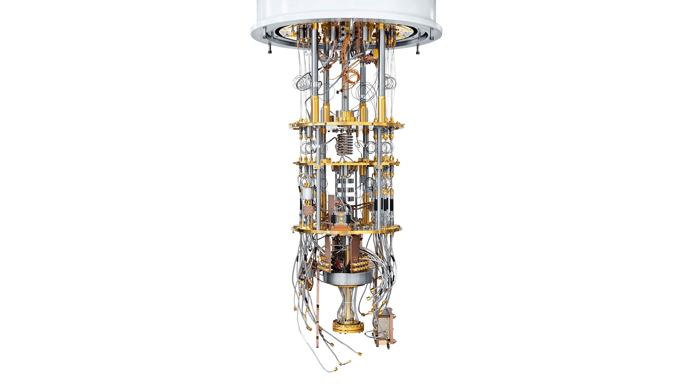
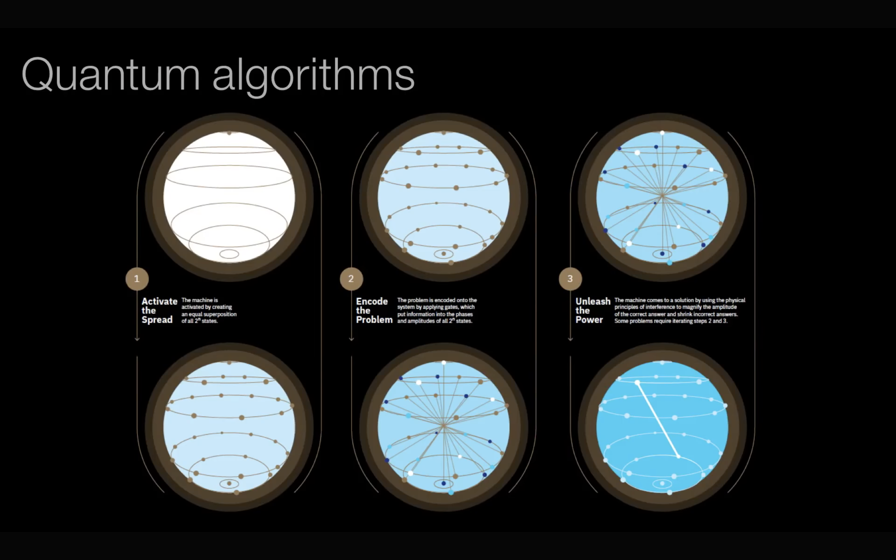

# **Quantum Computing**

Rather than store information using bits represented by 0s or 1s as conventional digital computers do, quantum computers use quantum bits, or qubits, to encode information as 0s, 1s, or both at the same time. This superposition of states—along with the other quantum mechanical phenomena of entanglement and tunneling—enables quantum computers to manipulate enormous combinations of states at once.

Quantum Computers should be thought of aa special purpose machines that can solve certain problems a lot  better. Quantum Computers are not going to replace Classical computers, they are going to be used as co-processors for Classical Computers like the GPUs. We can perform complex instructions on Quantum Computers all day, but at the end of the day we need Classical Computers to interpret the calculations and make them understandable to us.

QUBITS -

A bit is binary - it stores information in strings of binary digits that can only be 0 or 1. But qubits are made of subatomic particles, so they operate according to subatomic logic. Qubits can be 0, 1, or what we call a linear combination of 0 and 1. This fluid combination of amplitudes is at the core of quantum computing. Before you measure a qubit, it exists in a state called superposition. You can think about it as a quantum version of a probability distribution, where each qubit has some amplitude for being 0, and some amplitude for being 1.

Superposition is the reason that quantum computers can store and manipulate vast amounts of data compared to classical computers. When two or more qubits are in this closed state of superposition, they relate to one another through the phenomenon of entanglement. This means that their final outcomes, when we measure them, are mathematically related.

But if you want to describe very highly entangled states using ordinary bits, it's extremely expensive.
Imagine that you had a primitive 10-qubit computer. It could store 2^10 values in parallel. To describe this entangled configuration with a classical computer, you’d need 16 kilobytes, or 16 thousand bits.
Expand to a system with 500 entangled qubits, and you now require more classical bits than there are atoms in the known universe. This is exactly what Feynman meant when he said that classical computers weren’t scalable for simulating quantum mechanics.

For a quantum computer to be of any use, you need to measure information from the qubits to get an output. The problem is, when a quantum system is measured, it collapses into a classical state.

When you look at the system, then the amplitudes become probabilities. To extract an answer from the quantum system that isn’t just a random outcome of probability, like the flip of a coin, we have to use interference. Interference is just what amplitudes do when you add them up.

Scientists can harness interference by creating a deterministic sequence of qubit gates. These qubit gates cause the amplitudes to add up constructively. This means that they’re mathematically guaranteed to boost the probability of seeing one of 
the right answers.

You might ask, how could you possibly concentrate all this on the right answer when you yourself don't know in advance which answer is the right one? This is exactly why designing quantum algorithms is so difficult and why we have a whole field that's been studying it for decades.

An algorithm is a step-by-step procedure to perform a calculation, or a sequence of instructions to solve a problem, where each step can be performed on a computer. Therefore, an algorithm is a quantum algorithm when it can be performed on a quantum computer. In principle it is possible to run all classical algorithms on a quantum computer. However, the term quantum algorithm is applied to algorithms of which at least one of the steps is distinctly ‘quantum’, using superposition or entanglement.

INSTRUCTIONS - These instructions are used to manipulate probabilities of the different states.

Hadamard Initialisation - we apply Hadamard gate on a quit to create superposition.

5 types of instructions- 

- MEASURE
- HADAMARD
- PHASE
- T
- CNOT

all the above instructions act on one qubit except CNOT gate (it acts on two qubits). These instructions act like gates in classical computers, but these are not physically etched on the chip, these are instructions that you apply on these probabilities.

Entanglement - when two sub-atomic particles are described by one wave function.

Coherence time - it is the time that the quantum information lasts. And that matters because it determines how many different operations can be performed before the quantum information is lost.

### **The power of quantum algorithms**

Problems that are fundamentally unsolvable by classical algorithms (so called undecidable problems) cannot be solved by quantum algorithms either. The added value of quantum algorithms is that they can solve some problems significantly faster than classical algorithms. The best-known examples are Shor’s algorithm and Grover’s algorithm. Shor’s algorithm is a quantum algorithm for integer factorization. Simply put, when given an integer N, it will find its prime factors. It can solve this problem exponentially faster than the best-known classical algorithm can. Grover’s algorithm can search an unstructured database or unordered list quadratically faster than the best classical algorithm with this purpose.

**~~~~~~ My reason for learning Quantum Computing ~~~~~~ **

It is intellectually interesting. It is completely outside my intuitive thinking, like fundamentally how a Quantum Computer can out-perform a Classical Computer.

